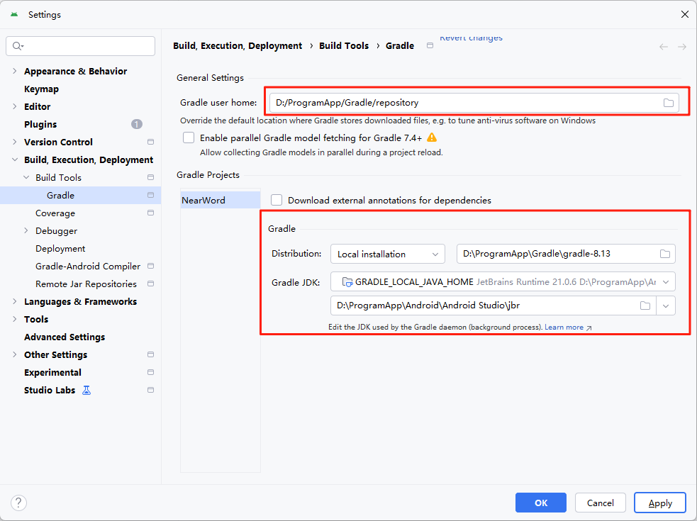

[TOC]

# 一、配置项目Gradle

按下面配置，不然项目启动时，会重新下载gradle，并且把依赖下载到C盘。



# 二、引入ViewModel

1. 加依赖
   `app/build.gradle.kts` 追加

   ```kotlin
   implementation(libs.androidx.lifecycle.viewmodel.compose)
   ```

2. 声明坐标

   `libs.versions.toml`追加

   先在 [versions] 区域新增版本号（保持与 lifecycle-runtime-ktx 同版本即可）

   ```toml
   lifecycleViewModelCompose = "2.6.1"
   ```

   再在 [libraries] 区域新增库

   ```toml
   androidx-lifecycle-viewmodel-compose = { group = "androidx.lifecycle", name = "lifecycle-viewmodel-compose", version.ref = "lifecycleViewModelCompose" }
   ```

3. 用法

   ```kotlin
   @Composable
   fun HomeScreen(vm: HomeViewModel = viewModel()) { … }
   ```

4. 职责说明

   “存” 与 “算” 都归它，“显” 归 Compose。

   | 职责            | 示例                                    | 禁止做的事                                                   |
   | --------------- | --------------------------------------- | ------------------------------------------------------------ |
   | 1. 存 UI 状态   | `val uiState: StateFlow<CustomUiState>` | 不要直接 `rememberSaveable` 大量数据                         |
   | 2. 收用户事件   | `fun onDoThing(input: String)`          | 不要持有 `Context`、`View`、`Bitmap` 等难回收对象            |
   | 3. 调度数据层   | 调用 `QueryDataUseCase` / `Repository`  | 不要自己直接 `Room.databaseBuilder(context)`（用 DI 注入）   |
   | 4. 协程作用域   | `viewModelScope.launch { … }`           | 不要开 `GlobalScope` 或 `rememberCoroutineScope` 做网络/数据库 |
   | 5. 配置变更存活 | 屏幕旋转、深色模式切换后状态仍在        | 不要把它当单例，不要放耗时初始化在 `init` 里死等             |

# 三、引入中英词典数据

在开发中英词典应用时，首先需要考虑如何引入词典数据。数据来源可以是CSV文件、SQLite数据库等格式，关键在于能够高效地读取数据，并将其存储到应用的数据库中。经过详细的调研，我发现了以下三种可行的方案：

1. **ECDICT**
   - **来源**：[Releases · skywind3000/ECDICT](https://github.com/skywind3000/ECDICT/releases)
   - **特点**：该词典数据非常全面，涵盖了大量单词及其详细释义，但文件体积较大，对于轻量级应用来说可能不太合适。因此，我暂时不将其作为首选方案。
2. **十万词英汉词典词库SQLite数据库**
   - **来源**：[十万词英汉词典词库SQLite数据库 - GitCode](https://gitcode.com/open-source-toolkit/daa3c)
   - **特点**：该词典数据库轻量级，体积较小，适合在移动设备上使用。我将优先尝试使用这个数据库，以验证其是否满足我们的需求。
3. **ITeye技术社区**
   - **来源**：[ITeye技术社区](https://www.iteye.com/)
   - **特点**：该社区似乎也提供了相关的词典数据，但目前网站无法访问。我将持续关注该资源，以便在需要时作为备选方案。

综上所述，我将首先尝试使用**十万词英汉词典词库SQLite数据库**，因为它在轻量级和数据完整性之间取得了较好的平衡。如果在后续开发过程中发现该数据库无法满足我们的需求，我们将重新评估其他方案。

# 四、引入 Room / SQLite / KSP

1. 加依赖

   `根目录/build.gradle.kts`中的plugins追加

   ```kotlin
   alias(libs.plugins.ksp) apply false //注册 KSP 插件
   ```

   `app/build.gradle.kts`中的plugins追加

   ```kotlin
    alias(libs.plugins.ksp) //启用 KSP 能力，模块才能识别 ksp(...) 语法
   ```

   `app/build.gradle.kts`中的dependence追加

   ```kotlin
   // Room 运行时与协程扩展
   implementation(libs.room.runtime)
   implementation(libs.room.ktx)
   
   // 可选：显式声明 SQLite 版本（Room 内部已带，可省略）
   implementation(libs.sqlite)
   
   // KSP 注解处理器——替 kapt，生成 Room 的 _Impl 类
   // 必须用 ksp(...) 而不是 implementation(...)，否则只下载库不跑代码生成
   ksp(libs.room.runtime)
   ksp(libs.room.compiler)
   ```

2. 声明坐标

   `libs.versions.toml`追加

   先在 [versions] 区域新增版本号

   ```toml
   room = "2.6.1"
   sqlite = "2.4.0"
   ksp = "1.9.24-1.0.20"   # 官方对应 Kotlin 2.0.21
   ```

   再在 [libraries] 区域新增库

   ```toml
   room-runtime = { group = "androidx.room", name = "room-runtime", version.ref = "room" }
   room-compiler = { group = "androidx.room", name = "room-compiler", version.ref = "room" }
   room-ktx = { group = "androidx.room", name = "room-ktx", version.ref = "room" }
   sqlite = { group = "androidx.sqlite", name = "sqlite", version.ref = "sqlite" }
   ```

   在 [plugins] 区域新增插件

   ```toml
   ksp = { id = "com.google.devtools.ksp", version.ref = "ksp" }
   ```

3. 用法

   ```kotlin
   // ① 定义实体
   @Entity(tableName = "englishwords")
   data class WordEntity(
       @PrimaryKey val word: String,
       val definition: String
   )
   
   // ② DAO
   @Dao
   interface WordDao {
       @Query("SELECT * FROM englishwords WHERE word = :word LIMIT 1")
       suspend fun query(word: String): EnglishWordEntity?
   }
   
   // ③ Database
   @Database(entities = [WordEntity::class], version = 1)
   abstract class AppDatabase : RoomDatabase() {
       abstract fun wordDao(): WordDao
   }
   
   // ④ 在 ViewModel 里查词
   class WordViewModel(app: Application) : AndroidViewModel(app) {
       private val dao = AppDatabase.getInstance(app).wordDao()
       fun query(word: String) = flow { emit(dao.query(word)) }
   }
   ```

4. 职责说明

   | 依赖           | 作用                                                         |
   | -------------- | ------------------------------------------------------------ |
   | `room-runtime` | 提供 `@Entity/@Dao/@Database` 注解与运行时 SQLite 封装       |
   | `room-ktx`     | 给 DAO 增加 **协程** / **Flow** 支持，省去手动线程切换       |
   | `sqlite`       | 显式指定 AndroidX SQLite 驱动版本（可选，Room 已内部引用）   |
   | `ksp`          | Kotlin 注解处理器，**编译期** 生成 `Room*_Impl` 代码，替 kapt 提速 |

# 五、引入测试依赖

1. 加依赖

   `app/build.gradle.kts` 追加

   ```kotlin
   testImplementation(libs.androidx.test.core)
   testImplementation(libs.kotlinx.coroutines.test)
   ```

2. 声明坐标

   `libs.versions.toml` 追加

   先在 `[versions]` 区域新增版本号

   ```toml
   androidxTestCore = "1.5.0"
   kotlinxCoroutinesTest = "1.8.0"
   ```

   再在 `[libraries]` 区域新增库

   ```toml
   androidx-test-core = { group = "androidx.test", name = "core", version.ref = "androidxTestCore" }
   kotlinx-coroutines-test = { group = "org.jetbrains.kotlinx", name = "kotlinx-coroutines-test", version.ref = "kotlinxCoroutinesTest" }
   ```

3. 用法

   **`ApplicationProvider`**：获取 Android `Context`，用于初始化依赖上下文的组件（如数据库、SharedPreferences）。

   ```kotlin
   import androidx.test.core.app.ApplicationProvider
   
   val context = ApplicationProvider.getApplicationContext<Context>()
   ```

   **`kotlinx-coroutines-test`**：使用 `runTest` 简化协程测试，避免异步等待。

   ```kotlin
   import kotlinx.coroutines.test.runTest
   
   @Test
   fun `should load data successfully`() = runTest {
       val result = repository.loadData()
       assert(result.isSuccess)
   }
   ```

4. 职责说明

   | 库 / 依赖                 | 关键组件                 | 职责说明                                                     | 本地单元测试（test/）支持 | 真机/插桩测试（androidTest/）支持 | 禁止做的事                                                   |
   | ------------------------- | ------------------------ | ------------------------------------------------------------ | ------------------------- | --------------------------------- | ------------------------------------------------------------ |
   | `androidx.test:core`      | `ApplicationProvider`    | 提供模拟的 `ApplicationContext`，用于在测试中初始化依赖上下文的组件（如数据库、SharedPreferences）。可在 JVM 和设备上使用。 | ✅ 支持                    | ✅ 支持                            | 不要用于生产代码；不要长期持有 `Context` 引用；不要依赖系统服务（如 `LocationManager`） |
   | `kotlinx-coroutines-test` | `runTest`、`runBlocking` | 提供协程测试专用作用域，支持虚拟时间调度、异常捕获、自动等待协程完成，是 `runBlockingTest` 的现代替代方案。 | ✅ 支持（推荐）            | ✅ 支持                            | 不要使用已废弃的 `runBlockingTest`；不要在 `runTest` 外启动协程且不等待；避免混合真实调度器 |

# 六、单元测试或真机测试

- **本地单元测试（Unit Test）**
  - 位置：src/test/java/...
  - 特点：运行在本地 JVM，无需连接设备或模拟器，速度快。
  - 使用场景：ViewModel、UseCase、Repository 逻辑、纯协程逻辑。
  - 示例：使用 ApplicationProvider 获取 Context + 内存数据库（inMemoryDatabase）。
  - 命令：./gradlew test

- **插桩测试 / 真机测试（Instrumented Test）**
  - 位置：src/androidTest/java/...
  - 特点：运行在真实设备或模拟器上，速度慢，但环境真实。
  - 使用场景：Room 数据库（尤其是 .createFromAsset()）、ContentProvider、JobScheduler、系统权限相关逻辑。
  - 必须条件：当测试代码依赖 assets 文件、真实数据库、Android 系统服务时，必须使用此方式。
  - 命令：./gradlew connectedAndroidTest

**什么时候需要真机或模拟器？**
**✅ 需要真机/模拟器的情况：**

  - 使用 Room 的 .createFromAsset("databases/app.db")
  - 使用 .createFromFile() 加载外部数据库
  - 测试与系统服务交互的组件（如 AlarmManager、WorkManager 实际调度）
  - 使用 Espresso 或 UI Automator 做 UI 测试

**❌ 不需要真机的情况：**

  - 仅使用 ApplicationProvider 获取 Context
  - 使用 in-memory database 测试 DAO
  - 测试纯 Kotlin 逻辑、协程、Flow 转换
  - 使用 Mockk 或 Mockito 模拟依赖
